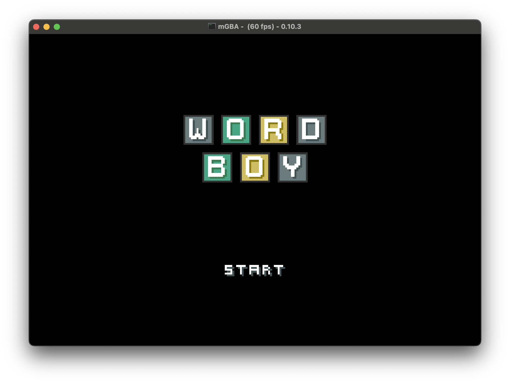

# WordBoy

A Wordle clone for the GameBoy Advance.



## Building

To build a ROM, you'll need the `arm-none-eabi` rust toolchain, which can be found
[here](https://developer.arm.com/downloads/-/arm-gnu-toolchain-downloads). With the toolchain installed
and in your `PATH`, you can build the project by simply running:

```sh
cargo build
```

Alternatively, you can run the OS in an emulator such as [mGBA](https://mgba.io) by running:

```sh
CARGO_TARGET_THUMBV4T_NONE_EABI_RUNNER=<PATH_TO_GBA_EMULATOR> cargo run
```
